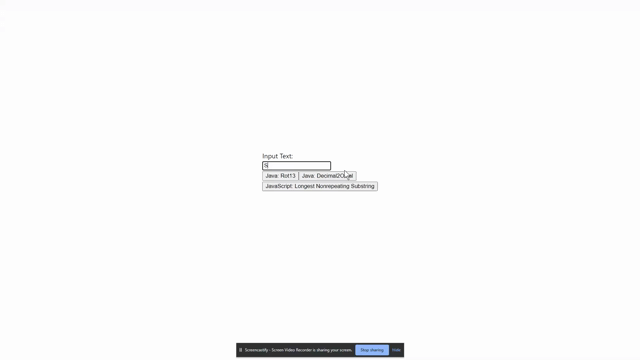

# Week1OnboardingCodingActivity9-13-2021

Java:
1) Write a program to encrypt a message using the ROT13 technique.
2) Write a program to convert a decimal number to its octal equivalent.

JS:
Write a function that returns the longest non-repeating substring for a string input.



## Instructions:

From terminal

```git clone https://github.com/JMantis0/Week1OnboardingCodingActivity9-13-2021.git```

### To start server locally
Open Server directory as a gradle project in a Java IDE
from terminal in Server directory
```
gradle build
```
Then start the spring boot server by running the main method in JavaServiceApplication


### To Start front end locally
From terminal navigate to Client directory and
```
npm i
npm start
```

Browse to http://localhost:3000 to explore the program.

Coming soon:  Live deployment with aws


